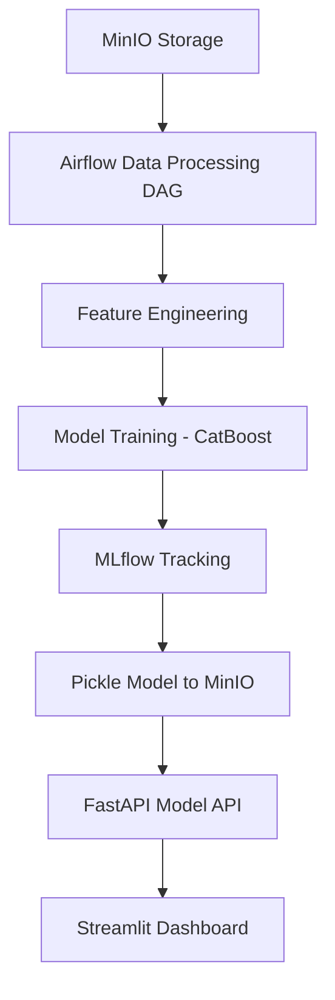

# 🛒 Instacart Recommender System

An **end-to-end Machine Learning recommender system** to predict which product a customer will reorder next on Instacart. Built to simulate a real-world ML pipeline with automation, tracking, and cloud deployment.


---

## 🚀 Features

- ✅ Data Engineering pipeline with **Airflow**
- ✅ Raw data ingestion & preprocessing stored on **MinIO**
- ✅ Model training & logging with **MLflow**
- ✅ Model serving through **FastAPI**
- ✅ Interactive dashboard using **Streamlit**
- ✅ Dockerized for containerized deployments

---

## 📦 Tech Stack

| Tool          | Purpose                          |
|---------------|----------------------------------|
| Python 3.10   | Core development                 |
| Airflow       | Orchestration of pipelines       |
| MLflow        | Model tracking & experiments     |
| MinIO         | Object storage (S3 alternative)  |
| FastAPI       | Serving model APIs               |
| Streamlit     | Interactive dashboards           |
| Docker        | Containerization                 |

---

## 📊 Project Architecture



---

## 📂 Repository Structure

```
instacart-recommender/
│
├── api/                # FastAPI app
│   ├── main.py
│   ├── model_utils.py
│   ├── minio_utils.py
│   └── requirements.txt
│
├── dashboard/          # Streamlit dashboard
│   ├── streamlit_dashboard.py
│   ├── requirements.txt
│
├── dags/               # Airflow DAGs
├── data/               # Data folder (optional)
├── scripts/            # Helper scripts
├── Dockerfile          # Docker for FastAPI/Streamlit
├── docker-compose.yml  # Compose for local stack
└── README.md
```

---

## 🚀 Running Locally

### 1️⃣ Clone the repo
```bash
git clone https://github.com/Dharmik2905/instacart-recommender.git
cd instacart-recommender
```

### 2️⃣ Start MinIO (if local)
```bash
docker run -p 9000:9000 -p 9001:9001 \
  -e MINIO_ROOT_USER=minioadmin \
  -e MINIO_ROOT_PASSWORD=minioadmin \
  minio/minio server /data --console-address :9001
```

### 3️⃣ Start FastAPI
```bash
cd api
uvicorn main:app --reload
```
Visit [http://localhost:8000/docs](http://localhost:8000/docs)

### 4️⃣ Start Streamlit
```bash
cd dashboard
streamlit run streamlit_dashboard.py
```
Visit [http://localhost:8501](http://localhost:8501)

---

## 🐳 Dockerized Setup

### All-in-One (FastAPI + Streamlit + MinIO)
```bash
docker-compose up --build
```

---
---

## 🙏 Acknowledgements

Special thanks to [Austin Poole](https://www.linkedin.com/in/austinpoole) for his guidance and inspiring this project.

---

## 📬 Contact

**Dharmik Bhagat**  
📧 dharmik.bhagat@tamu.edu 
🔗 [LinkedIn](https://linkedin.com/in/dharmikbhagat) | [GitHub](https://github.com/Dharmik2905)

---

## 📜 License

This project is licensed under the MIT License.
